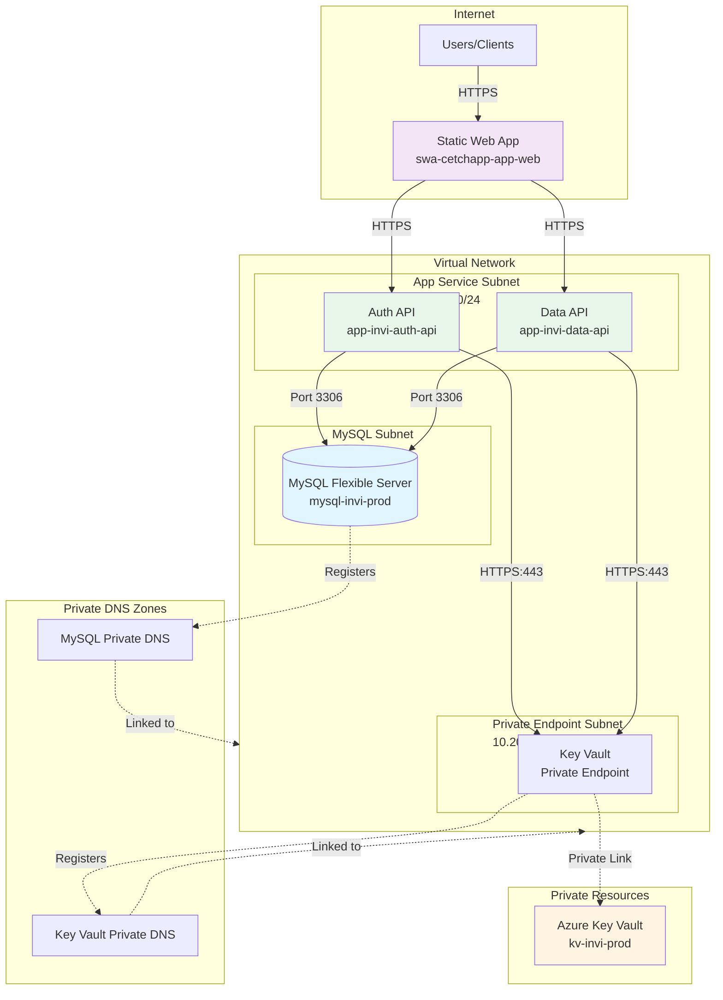

# Azure Infrastructure for INVI Application

This repository contains Azure infrastructure-as-code (IaC) using Bicep to deploy a secure, production-grade application platform for the INVI workload. The infrastructure provisions a multi-tier architecture with network isolation, private connectivity, and role-based access control.

## What This Deploys

The infrastructure deploys the following Azure resources in Sweden Central (with Static Web App in East US 2):

- **Virtual Network** with three isolated subnets (App Service integration, MySQL delegation, Private Endpoints)
- **Network Security Groups** to control traffic flow between components
- **MySQL Flexible Server** with private networking and no public access
- **Two App Service instances** (Data API and Auth API) running on Linux with VNet integration
- **Azure Key Vault** accessible only via private endpoint
- **Static Web App** for frontend hosting
- **Private DNS Zones** for name resolution of private endpoints
- **RBAC role assignments** granting App Services access to Key Vault secrets

## Architecture Overview



### Network Security

- **App Service NSG**: Allows outbound to MySQL (3306) and Private Endpoints (443), denies other VNet traffic
- **MySQL NSG**: Allows inbound from App Service subnet and self (3306), denies other VNet access
- **Private Endpoint NSG**: Allows inbound HTTPS (443) from App Service subnet
- **Public network access**: Disabled for MySQL and Key Vault; enforced via private endpoints and delegated subnets

### Deployment Dependencies

Resources are deployed in this order to satisfy dependencies:

1. **NSG Module** → Network Security Groups
2. **Network Module** → VNet and subnets (requires NSG IDs)
3. **Private DNS Module** → DNS zones and VNet links (requires VNet ID)
4. **MySQL Module** → Database server (requires subnet ID and DNS zone ID)
5. **Key Vault Module** → Key Vault and private endpoint (requires subnet ID and DNS zone ID)
6. **App Service Module** → App Service Plan and Web Apps (requires App Service subnet ID)
7. **RBAC Module** → Role assignments (requires Key Vault name and App Service managed identities)
8. **Static Web App Module** → Frontend hosting (independent)

## Repository Layout

```
.
├── README.md                           # This file
├── Infrastructure/
│   ├── main.bicep                      # Main deployment template (orchestrates all modules)
│   ├── main.json                       # ARM JSON compiled from main.bicep
│   ├── README.md                       # Infrastructure documentation (currently empty)
│   ├── environments/
│   │   └── prod.bicepparam            # Production environment parameters
│   └── modules/
│       ├── network.bicep              # VNet with three subnets (delegated for App Service and MySQL)
│       ├── nsg.bicep                  # Network Security Groups with traffic rules
│       ├── privatedns.bicep           # Private DNS zones for MySQL and Key Vault
│       ├── mysql.bicep                # MySQL Flexible Server with private networking
│       ├── keyvault.bicep             # Key Vault with private endpoint
│       ├── appservice.bicep           # App Service Plan + Auth API + Data API
│       ├── rbac.bicep                 # RBAC assignments for Key Vault access
│       └── staticwebapp.bicep         # Static Web App infrastructure provisioning
└── .github/
    └── copilot-instructions.md         # Bicep conventions and deployment guidance
```

## Module Reference

### `network.bicep`
**Purpose**: Creates the VNet and three subnets with proper delegations and NSG associations.

**Key Features**:
- App Service integration subnet with delegation to `Microsoft.Web/serverFarms`
- MySQL subnet with delegation to `Microsoft.DBforMySQL/flexibleServers`
- Private Endpoint subnet with network policies enabled
- Attaches NSGs to each subnet

**Outputs**: VNet ID, VNet name, subnet IDs for MySQL, App Service, and Private Endpoints

### `nsg.bicep`
**Purpose**: Defines Network Security Groups to enforce least-privilege network access between components.

**Key Features**:
- **App Service NSG**: Allows MySQL:3306 and Private Endpoint HTTPS:443, blocks other VNet destinations
- **MySQL NSG**: Allows inbound from App Service subnet and intra-MySQL-subnet traffic, denies other sources
- **Private Endpoint NSG**: Allows inbound HTTPS from App Service subnet

**Outputs**: NSG resource IDs

### `privatedns.bicep`
**Purpose**: Provisions private DNS zones for MySQL and Key Vault, linked to the VNet for name resolution.

**Key Features**:
- MySQL Private DNS Zone: `{workloadName}-{environment}.private.mysql.database.azure.com`
- Key Vault Private DNS Zone: `privatelink.vaultcore.azure.net`
- VNet links with auto-registration disabled

**Outputs**: DNS zone IDs and names

### `mysql.bicep`
**Purpose**: Deploys MySQL Flexible Server with private networking, no public access.

**Key Features**:
- Deployed into delegated subnet
- Integrated with private DNS zone
- Public network access disabled
- Configurable SKU, storage, backup retention, and HA mode
- Auto-grow enabled for storage

**Outputs**: MySQL server ID, name, FQDN

### `keyvault.bicep`
**Purpose**: Provisions Azure Key Vault with RBAC authorization and private endpoint connectivity.

**Key Features**:
- RBAC authorization enabled (no access policies)
- Public network access disabled
- Soft delete enabled (90-day retention)
- Private endpoint in dedicated subnet
- Integrated with Key Vault private DNS zone

**Outputs**: Key Vault ID, name, URI, private endpoint ID

### `appservice.bicep`
**Purpose**: Deploys App Service Plan and two Linux-based web apps (Auth API and Data API) with VNet integration.

**Key Features**:
- Linux App Service Plan with configurable SKU
- System-assigned managed identities for both apps
- VNet integration via delegated subnet
- HTTPS-only, FTPS disabled, TLS 1.2 minimum
- Basic publishing credentials (FTP/SCM) disabled for security
- Always-on enabled, HTTP/2 supported

**Outputs**: App Service Plan ID/name, Auth API and Data API IDs/names/hostnames, managed identity principal IDs

### `rbac.bicep`
**Purpose**: Assigns the "Key Vault Secrets User" built-in role to both App Service managed identities.

**Key Features**:
- Uses Azure built-in role `4633458b-17de-408a-b874-0445c86b69e6` (Key Vault Secrets User)
- Scoped to the Key Vault resource
- Allows App Services to read secrets without broader permissions

**Outputs**: None

### `staticwebapp.bicep`
**Purpose**: Provisions Azure Static Web App infrastructure. Repository and build configuration are managed separately.

**Key Features**:
- Infrastructure-only provisioning (no repository link)
- Staging environments enabled
- Config file updates allowed
- Deployed to East US 2 (Static Web Apps not available in Sweden Central)

**Outputs**: Static Web App ID, name, default hostname

## Prerequisites

Before deploying this infrastructure, ensure you have:

1. **Azure CLI** installed and authenticated
   ```bash
   az login
   az account set --subscription <subscription-id>
   ```

2. **Bicep CLI** (bundled with Azure CLI 2.20.0+)
   ```bash
   az bicep version
   ```

3. **Resource Group** created in the target region
   ```bash
   az group create --name <resource-group-name> --location swedencentral
   ```

4. **Permissions**: Contributor or Owner role on the target resource group and subscription (for RBAC assignments)

5. **Parameter File**: Review and customize `Infrastructure/environments/prod.bicepparam` with your values:
   - Network CIDR ranges (if defaults conflict with existing networks)
   - MySQL admin credentials (**store securely; do not commit plaintext passwords**)
   - SKU tiers and sizing
   - Workload name, environment, and instance identifier
   - Static Web App name and region

## Deployment Instructions

### Validate the Bicep Template

Before deployment, validate the template syntax and parameters:

```bash
az deployment group validate \
  --resource-group <resource-group-name> \
  --template-file Infrastructure/main.bicep \
  --parameters Infrastructure/environments/prod.bicepparam
```

### Deploy the Infrastructure

Deploy using the Azure CLI with the production parameter file:

```bash
az deployment group create \
  --resource-group <resource-group-name> \
  --template-file Infrastructure/main.bicep \
  --parameters Infrastructure/environments/prod.bicepparam \
  --name invi-prod-deployment-$(date +%Y%m%d-%H%M%S)
```

The deployment will take approximately 10-15 minutes due to MySQL provisioning and private endpoint setup.

### What-If Analysis (Optional)

Preview changes before deployment:

```bash
az deployment group what-if \
  --resource-group <resource-group-name> \
  --template-file Infrastructure/main.bicep \
  --parameters Infrastructure/environments/prod.bicepparam
```

### Check Deployment Status

Monitor the deployment progress:

```bash
az deployment group list \
  --resource-group <resource-group-name> \
  --output table

az deployment group show \
  --resource-group <resource-group-name> \
  --name <deployment-name> \
  --query properties.provisioningState
```

### Verify Outputs

After successful deployment, retrieve output values:

```bash
az deployment group show \
  --resource-group <resource-group-name> \
  --name <deployment-name> \
  --query properties.outputs
```

## Adding a New Environment

To deploy additional environments (e.g., dev, staging):

1. **Create a new parameter file** under `Infrastructure/environments/`:
   ```bash
   cp Infrastructure/environments/prod.bicepparam Infrastructure/environments/dev.bicepparam
   ```

2. **Update the parameters** in the new file:
   - Change `environment = 'dev'`
   - Update `instance` (e.g., `'002'`) to avoid naming conflicts
   - Adjust VNet CIDR ranges if deploying to the same region to prevent overlap
   - Use smaller SKU tiers for non-production environments (e.g., `Burstable` for MySQL)
   - Update tags to reflect the environment

3. **Deploy using the new parameter file**:
   ```bash
   az deployment group create \
     --resource-group <dev-resource-group-name> \
     --template-file Infrastructure/main.bicep \
     --parameters Infrastructure/environments/dev.bicepparam
   ```

4. **Maintain naming conventions** as documented in `.github/copilot-instructions.md`:
   - Use lowercase environment identifiers
   - Follow the pattern: `{resourceType}-{workloadName}-{component}-{environment}-{instance}`

## Configuration Notes

### Tags

All resources are tagged consistently using values from the parameter file:
- `environment`: Deployment environment (prod, dev, etc.)
- `application` or `workloadName`: Application identifier
- `managedBy`: Deployment method (bicep)

### Networking

- **VNet Address Space**: `10.20.0.0/16` (prod default)
- **App Service Subnet**: `10.20.1.0/24` (delegated to `Microsoft.Web/serverFarms`)
- **MySQL Subnet**: `10.20.2.0/24` (delegated to `Microsoft.DBforMySQL/flexibleServers`)
- **Private Endpoint Subnet**: `10.20.3.0/24` (for Key Vault and future private endpoints)

Adjust these ranges in the parameter file if they conflict with existing networks or peering requirements.

### Security Best Practices

- **No public access**: MySQL and Key Vault are accessible only via private networking
- **RBAC over access policies**: Key Vault uses Azure RBAC instead of legacy access policies
- **Managed identities**: App Services use system-assigned identities to access Key Vault (no credential management)
- **TLS enforcement**: HTTPS-only, minimum TLS 1.2 for all web services
- **Network segmentation**: NSGs enforce least-privilege communication paths
- **Credential management**: Store sensitive parameters (e.g., MySQL passwords) in Azure Key Vault or GitHub Secrets; do not commit to source control

## Known Issues and Gaps

- **`Infrastructure/README.md`**: Currently empty; should contain module-level documentation
- **`monitoring.bicep`**: Referenced in planning discussions but not yet implemented (no Application Insights, Log Analytics, or alerting)
- **Parameter file security**: Sensitive values should be externalized (use `--parameters` CLI overrides or Azure Key Vault references)

## Maintenance and Updates

### Regenerate ARM JSON

If you modify `main.bicep` or any modules, regenerate the compiled ARM template:

```bash
az bicep build --file Infrastructure/main.bicep --outfile Infrastructure/main.json
```

### Lint Bicep Files

Check for best practices and errors:

```bash
az bicep lint --file Infrastructure/main.bicep
```

### Update Dependencies

Keep Azure CLI and Bicep CLI up to date:

```bash
az upgrade
az bicep upgrade
```

## Contributing

When modifying this infrastructure:

1. Follow conventions documented in `.github/copilot-instructions.md`
2. Test changes in a non-production environment first
3. Use `az deployment group what-if` to preview changes
4. Update this README if adding new modules or changing architecture
5. Maintain parameter-driven design (avoid hardcoded values in templates)

## License

*(Add your license information here)*

## Support

For questions or issues related to this infrastructure, contact the infrastructure team or open an issue in this repository.
